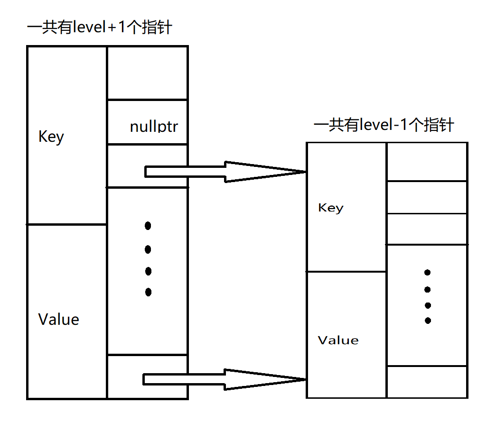

# SkipList

## skip_list_node

跳表的结点在`skip_list_node.h`文件中实现, 结构如下

``` C++
template <typename K, typename V>    // key and value
class skip_list_node {
    friend class skip_list<K, V>;
private:
    K key;
    V value;
    int level;
    skip_list_node<K, V>** forward;
public:
    skip_list_node() {}
    skip_list_node(K k, V v, int level);
    ~skip_list_node();
    K get_key() const;
    V get_value() const;
};
```

下面简单介绍一下结点的成员`forward`.

在构造函数中, `forward`会像如下这样被初始化

``` C++
forward = new skip_list_node<K, V>* [level + 1];	// 0~level层共level+1层
```

`forward`指向一个长度为`level+1`的数组, 数组的元素都是`skip_list_node<K, V>*`类型的, 即如下图所示.



forward有k个元素, 则说明该结点有k个指针可以指向后继结点. `forward[i]`指向的是第i层的后继结点


## skip_list

`skip_list`支持构造一个空的快表, 也支持从文件中读取格式化的数据来建立快表.

默认支持在调用析构函数时将快表中的所有内容存储到同文件夹下的`skip_list_dump`文件中

目前实现了插入, 查找和删除的功能.


todo: 让快表监听某个端口, 其他进程可以通过向端口发送格式化的数据来存储信息


## skip_list_server

使用epoll来监听端口7700, 其他进程可以和此端口建立连接, 发送规格化的数据如`value:string\n`就可以存储到对应的快表中. 等到进程关闭连接后将快表中的数据复制到`server_dump`文件夹下, 文件名为`dump_端口号`

当占用端口为k的进程连接到skip_list_server时, 会到`server_dump`中寻找文件名为`dump_k`的文件, 如果有就从其中导入数据, 如果没就建立一个空的skip_list
